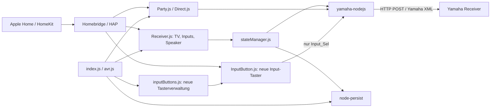

# Architektur: homebridge-yamaha-receiver

Analyse vom 21.09.2026, Ausgangsversion 0.3.3. Die Abschnitte zum Bestand
beschreiben den vorgefundenen Code; die neue Input-Taster-Erweiterung ist
separat beschrieben. Gegenstand ist dieses Homebridge-Plugin, nicht der
Home-Assistant-MCP-Server.

## Zweck und Systemgrenzen

Das CommonJS-Plugin verbindet Apple Home/HomeKit über Homebridge mit
Yamaha-Receivern im lokalen Netzwerk. Ein konfigurierter Receiver kann eine
Hauptzone und bis zu drei zusätzliche Zonen besitzen. Das Plugin bietet
Ein/Aus, Input-Auswahl, Lautstärke, Stummschaltung und Fernbedienung sowie
optionale Party- und Pure-Direct-Schalter.

`package.json` verlangt Node.js ^22.10.0 oder ^24.0.0 und Homebridge ^1.8.0
oder ^2.0.0. Laufzeitabhängigkeiten sind `yamaha-nodejs` und `node-persist`.
Die alten Versionsgrafiken im README entsprechen diesen Anforderungen nicht.

## Komponenten des Bestands

| Datei | Verantwortung |
|---|---|
| `index.js` | Registriert die Plattform `YamahaReceiver`, übernimmt Konfiguration, Logging und Persistenzpfad; startet `AVR.init` nach `didFinishLaunching`. |
| `lib/avr.js` | Fragt Modell, System-ID, Features und Inputs ab; baut Gerätekonfigurationen und Zubehör für aktive Zonen. |
| `accessories/Receiver.js` | Ein externes HomeKit-Zubehör pro Zone mit `Television`, verknüpften `InputSource`-Diensten und `TelevisionSpeaker`; optional Lautstärke als Lampe oder Ventilator. |
| `lib/stateManager.js` | Übersetzt Yamaha-Zustände und HomeKit-Werte; führt Power-, Input-, Lautstärke-, Mute- und Fernbedienungsbefehle aus. |
| `accessories/Party.js` | Separater externer Party-Schalter; Einschalten ruft zunächst `powerOn()` auf. |
| `accessories/Direct.js` | Separater externer Pure-Direct-Schalter; nutzt `setPureDirect()`. |
| `lib/persistMigration.js` | Migriert alte MD5-Dateinamen von node-persist 3 auf das SHA-256-Format von Version 4. |
| `config.schema.json` | Konfigurationsformular für die Homebridge-Oberfläche. |
| `config-sample.json` | Beispiel für die Homebridge-Konfiguration. |

## Start und Datenmodell

1. Homebridge registriert die Plattform und ruft nach dem Start `AVR.init` auf.
2. `node-persist` öffnet `yamaha-receiver-persist` neben dem Homebridge-
   Persistenzverzeichnis; gegebenenfalls werden alte Cache-Dateien migriert.
3. Das Plugin lädt `cachedDevices` und `cachedStates`, entfernt nicht mehr
   konfigurierte Geräte aus seinem eigenen Gerätecache und iteriert die IPs.
4. `getSystemConfig()` liefert System-ID, Modell, Features und Input-Namen.
   Ist ein Receiver nicht erreichbar, kann eine vorhandene Cache-Konfiguration
   verwendet werden. Ein noch unbekanntes, unerreichbares Gerät wird übersprungen.
5. Neue Geräte erhalten `zone1` und unterstützte weitere Zonen. Inputs bestehen
   aus `identifier`, `name`, Yamaha-`key` und `hidden`. Zusatzzonen enthalten
   „Main Zone Sync“; HDMI-Inputs werden dort im bisherigen Mapping entfernt.
6. Jede aktive Zone veröffentlicht ein externes Receiver-Zubehör. Optionale
   Party-/Direct-Schalter werden ebenfalls extern veröffentlicht.

HomeKit-UUIDs werden aus System-ID und Zone abgeleitet. Umbenennungen und
Sichtbarkeit von TV-Inputs sowie Zubehörnamen werden im Plugin-Cache gespeichert.
Der Gerätecache ist von Homebridges eigenem Zubehörcache zu unterscheiden.

## Laufender Betrieb und bestehender Einschaltpfad

Jede Receiver-Instanz fragt ihren Zustand regelmäßig über `getBasicInfo(zone)`
ab. Ein `processing`-Flag verhindert überlappende Polling-Läufe derselben Zone.
Bei Fehlern liefert `stateManager.getState()` den letzten Cache-Zustand oder
Defaultwerte. Ein sichtbarer Zustand ist deshalb nicht zwingend frisch.

`ActiveIdentifier` sucht den Yamaha-Input-Key zur HomeKit-Identifier-Nummer.
Wenn der gespeicherte Power-Zustand aus ist, folgt zuerst `powerOn(zone)` und
erst danach `setInputTo(source, zone)`. Dieser Ablauf erklärt das unerwünschte
Einschalten bei der bisherigen Input-Auswahl.

Die installierte Yamaha-Bibliothek erzeugt für `setInputTo()` ausschließlich
`<Input><Input_Sel>…</Input_Sel></Input>` innerhalb der ausgewählten Zone und
sendet XML per HTTP POST an `/YamahaRemoteControl/ctrl`. Power ist ein eigener
Befehl. Die Bibliothek gibt bei Schreibbefehlen den Antworttext zurück; ein
aufgelöstes Promise allein bestätigt noch keinen erfolgreichen Yamaha-RC-Code.

## Neue Input-Taster

Pro Receiver konfiguriert `inputButtons` eine Liste aus `input`, optionalem
`name` und optionaler `zone` (Standard: 1). `input` ist der Yamaha-Key, nicht der
in HomeKit umbenennbare Anzeigename. Zone und Input werden gegen den erkannten
bzw. gespeicherten Gerätebestand geprüft. Ungültige und doppelte Einträge
werden mit einer Meldung übersprungen.

`lib/inputButtons.js` verwaltet diese Zubehörteile als normale, über Homebridge
gebundene Schalter. Dadurch müssen sie nicht wie die externen TV-Zubehörteile
separat gekoppelt werden. Der Homebridge-Cache wird beim Neustart wiederverwendet;
entfernte Konfigurationseinträge werden abgemeldet. IDs hängen von System-ID,
Zone und Input-Key ab, nicht von Position oder Anzeigename.

`accessories/InputButton.js` stellt einen momentanen `Switch` bereit:

1. Home schreibt `On=true`.
2. Der Taster ruft ausschließlich `avr.setInputTo(input, zone)` auf.
3. Die Yamaha-Antwort muss einen erfolgreichen `RC="0"` enthalten. Transport-
   oder Gerätefehler werden an HomeKit zurückgegeben.
4. Der Schalter springt kurz danach auf aus zurück. Dies ist der Tasterzustand,
   nicht der Power-Zustand oder die Anzeige des aktuell ausgewählten Inputs.

`On=false` sendet keinen Receiver-Befehl. Der neue Pfad verwendet weder
`ActiveIdentifier` noch `powerOn`, Scenes oder Party Mode. Überlappende
Betätigungen desselben Tasters teilen den laufenden Befehl. Die bestehende
TV-Input-Auswahl und deren Einschaltverhalten bleiben unverändert.

Ein `StatelessProgrammableSwitch` meldet physische Tastendrücke an HomeKit;
für eine in Home betätigbare Aktion wird hier ein beschreibbarer `Switch`
verwendet. Die genaue Kacheldarstellung hängt von der Home-App-Version ab.

## Grenzen und Prüfpunkte

- Netzwerk-Standby muss am Receiver aktiviert sein. Ob eine konkrete Quelle im
  Standby gewählt oder per HDMI durchgereicht werden kann, ist modellabhängig.
  Es gibt keinen automatischen Einschalt-Fallback. Ein erfolgreicher RC-Code
  bestätigt die Befehlsannahme, nicht physische Signalweitergabe.
- Die Erweiterung garantiert, selbst keinen Power-Befehl zu senden. Effekte
  von Receiver-Firmware, HDMI-CEC oder anderen Automationen benötigen einen
  Test am konkreten Gerät.
- Der Bestand verwendet unverschlüsseltes Yamaha-HTTP im lokalen Netz.
- Bestandsauffälligkeiten außerhalb dieser Änderung: fehlender Default für
  `statePollingInterval` im Laufzeitcode; Tippfehler `zone…MaVolume` bei der
  Erstellung zusätzlicher Zonen; einige Setter bestätigen vor Abschluss ihrer
  Netzwerkbefehle; bestehende gecachte Inputlisten werden nicht vollständig
  aus einer neuen Systemkonfiguration erneuert.
- Neue automatisierte Tests decken Taster, Fehlerantworten, Konfiguration,
  Cache-Wiederverwendung und Entfernung ab. Der Geräte-/Home-App-Test bleibt
  ein eigener Schritt; diese Änderung installiert nichts auf dem Live-System.

## Referenzen

- [Homebridge API: Registrierung und Cache-Lebenszyklus](https://developers.homebridge.io/homebridge/interfaces/API.html)
- [DynamicPlatformPlugin: configureAccessory](https://developers.homebridge.io/homebridge/interfaces/DynamicPlatformPlugin.html)
- [HAP-Dienste](https://developers.homebridge.io/HAP-NodeJS/classes/Service.html)
- Konkrete Yamaha-Protokollimplementierung: lokal installiertes
  `node_modules/yamaha-nodejs/simpleCommands.js`, insbesondere `setInputTo`
  und `SendXMLToReceiver`.
